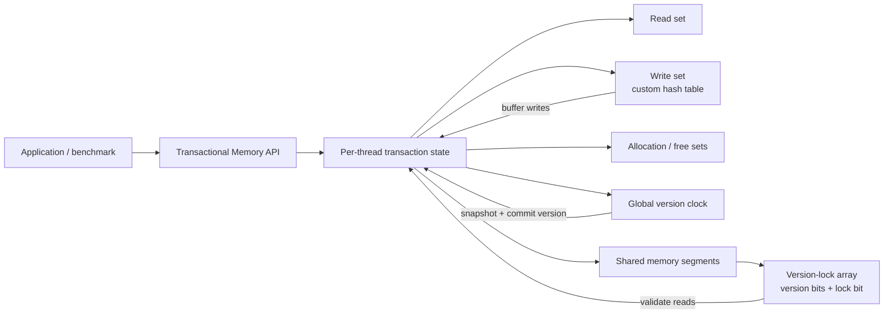
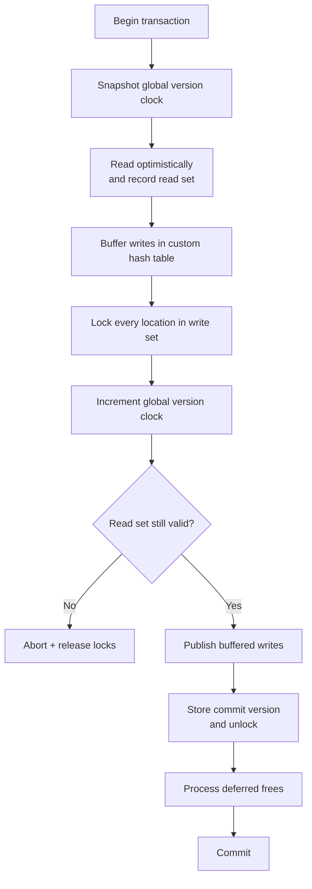

# Transactional Memory in C

**EPFL CS-453 project — full marks.**  A software transactional memory (STM) implementation in C11, built around the ideas of **Transactional Locking II (TL2)** and then aggressively optimized for throughput.

The optimization process took the implementation from roughly **0.5× the provided reference implementation to peaks around 10×** on the course benchmark, depending on workload. The interesting part of the project is not only the final number, but the systems work behind it: versioned locking, optimistic validation, C11 atomics, custom data structures, tagged pointers, deferred reclamation, allocation reduction, and hot-path micro-optimizations.

> **Start here:** [`source/tm.c`](source/tm.c) contains the transactional-memory implementation.

## What this project implements

The library exposes a small transactional-memory API (`tm_begin`, `tm_read`, `tm_write`, `tm_end`, allocation/free operations) over a shared memory region.

The design follows TL2's core model:

- transactions begin by snapshotting a **global version clock**;
- every aligned memory word is paired with a **version-lock** (version counter + lock bit);
- reads are optimistic and are accepted only if the observed version is compatible with the transaction snapshot;
- writes are buffered privately until commit;
- a committing writer locks its write set, advances the global version, validates previous reads, publishes buffered writes, and releases the locks with the new version;
- failed validation aborts the transaction instead of exposing inconsistent state.



## TL2-style commit path

The commit path is where the consistency protocol comes together.



A version-lock uses the low bit as the lock flag while the remaining bits represent the version:

```text
31                                    1 0
+--------------------------------------+---+
|              version                 | L |
+--------------------------------------+---+
                                         ^
                                         lock bit
```

## Performance work

The first correct versions were slower than the provided reference implementation. The final result came from repeatedly profiling the hot paths and replacing general-purpose operations with structures tailored to the transactional workload.

| Area | Optimization |
| --- | --- |
| **Versioning / validation** | TL2-style global version clock and per-location version-locks allow optimistic reads instead of serializing the whole memory region. |
| **Write-set lookup** | Replaced repeated linear lookup with a custom open-addressed hash table using pointer hashing and linear probing. |
| **Read-only transactions** | Reuse per-thread transaction objects instead of allocating a new object for every read-only transaction. |
| **Allocation strategy** | Lazy allocation of read/allocation/free sets and geometric growth reduce work for small transactions. |
| **Address resolution** | 64-bit tagged pointers encode a segment ID in the upper 16 bits and an offset in the lower 48 bits. |
| **Indexing** | Power-of-two alignment is converted to shifts (`log2(align)`) rather than repeated division when locating version-locks. |
| **Copy hot path** | Specialized aligned 64-bit copying avoids general `memcpy` overhead for the small aligned chunks used by the STM. |
| **Branch hot paths** | `likely` / `unlikely` compiler hints are used around common and exceptional paths. |
| **Memory management** | `mmap` backs regions/segments, while version-aware deferred reclamation prevents freeing a segment that an older transaction may still reference. |

Together, these changes moved benchmark performance from approximately **0.5× to as high as ~10× the reference implementation**. This figure is workload- and machine-dependent; it is included to show the magnitude of the optimization journey rather than as a universal throughput claim.

## Memory and reclamation design

Dynamic segments are addressed through tagged pointers:

```text
63                    48 47                               0
+-----------------------+----------------------------------+
|      segment id       |              offset              |
+-----------------------+----------------------------------+
        16 bits                         48 bits
```

Each transaction publishes the version at which it started. When a segment is logically freed, the implementation records the current version and removes the segment from the active map. Physical reclamation is delayed until every active transaction is newer than that free version.

This makes allocation/free compatible with optimistic transactions without allowing an old transaction to dereference memory that has already been returned to the OS.

## Repository layout

```text
.
├── README.md
├── include/
│   └── tm.h          # Public C API supplied for the project
└── source/
    ├── Makefile
    ├── macros.h      # branch prediction / utility macros
    └── tm.c          # main implementation — start here
```

## Build

A C11 compiler with atomics and POSIX support is required.

```bash
make -C source build
```

This builds the implementation as a shared library at the repository root.

To clean generated objects:

```bash
make -C source clean
```

## Systems concepts demonstrated

- C11 atomics and explicit memory ordering
- optimistic concurrency control
- versioned locks and transactional validation
- thread-local state
- custom hash-table implementation
- pointer tagging and bit manipulation
- `mmap` / `munmap`
- deferred memory reclamation
- cache- and allocation-conscious data structures
- branch prediction and hot-path optimization

## References

The concurrency protocol is based on **Transactional Locking II (TL2)**:

- Dave Dice, Ori Shalev, Nir Shavit, *Transactional Locking II*, DISC 2006.  
  https://people.csail.mit.edu/shanir/publications/Transactional_Locking.pdf

Additional implementation ideas were informed by:

- Artem Khyzha, *Proving consistency of concurrent data structures and transactional memory systems* (PhD thesis).  
  https://software.imdea.org/~gotsman/papers/khyzha-thesis.pdf
- Ben Hoyt, *How to implement a hash table (in C)* — used as a reference while building the write-set hash table.  
  https://benhoyt.com/writings/hash-table-in-c/

The `include/tm.h` API header comes from the EPFL course framework and retains its original authorship/license notice.