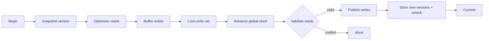
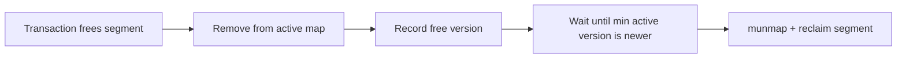

# Transactional Memory in C

**EPFL CS-453 project — full marks.** A software transactional memory (STM) implementation in C11, based on **Transactional Locking II (TL2)** and then aggressively optimized for throughput.

The optimization process took the implementation from roughly **0.5× the provided reference implementation to peaks around 10×** on the course benchmark, depending on workload. The interesting part of the project is not only the final number, but the systems work behind it: versioned locking, optimistic validation, C11 atomics, custom data structures, tagged pointers, deferred reclamation, allocation reduction, and hot-path micro-optimizations.

> **Start here:** [`source/tm.c`](source/tm.c) contains the transactional-memory implementation.

## TL2 in a nutshell

Software transactional memory lets threads group reads and writes into transactions that either **commit atomically** or **abort and retry**, without protecting the whole program with one coarse-grained lock.

This implementation follows the core ideas of **Transactional Locking II (TL2)**:

- a transaction starts by snapshotting a **global version clock**;
- every aligned memory location is associated with a **version-lock** containing a version counter and a lock bit;
- reads happen optimistically and are accepted only if the observed version is compatible with the transaction snapshot;
- writes are buffered privately rather than immediately modifying shared memory;
- at commit, the transaction locks its write set, advances the global version, validates its earlier reads, publishes the buffered writes, and releases the locks with the new version;
- failed validation aborts the transaction instead of exposing inconsistent state.

A version-lock uses the low bit as the lock flag while the remaining bits represent the version:

```text
31                                    1 0
+--------------------------------------+---+
|              version                 | L |
+--------------------------------------+---+
                                         ^
                                         lock bit
```

### TL2-style commit path



## Tagged pointers and version-aware reclamation

One of the more interesting parts of the implementation is supporting **dynamic transactional memory segments** safely while other transactions may still hold old references.

Dynamic addresses are represented as 64-bit tagged pointers:

```text
63                    48 47                               0
+-----------------------+----------------------------------+
|      segment id       |              offset              |
+-----------------------+----------------------------------+
        16 bits                         48 bits
```

The upper 16 bits identify a segment and the lower 48 bits encode the offset inside that segment. Resolving a transactional address therefore gives both the real memory address and the corresponding version-lock without exposing raw segment pointers through the API.

Freeing a segment is also deferred rather than immediate. Each active transaction publishes the global version at which it started. When a segment is logically freed, the implementation:

1. removes it from the active segment map so new transactions cannot access it;
2. records the version at which it was freed;
3. keeps the underlying allocation alive while any older transaction may still reference it;
4. physically `munmap`s the segment only once every active transaction has advanced beyond that version.



This is effectively a lightweight **version/epoch-based reclamation scheme** tied directly to the STM clock. It allows optimistic transactions and dynamic allocation to coexist without letting an old transaction dereference memory that has already been returned to the OS.

## Performance work

The first correct versions were slower than the provided reference implementation. The final result came from repeatedly profiling the hot paths and replacing general-purpose operations with structures tailored to the transactional workload.

| Area | Optimization |
| --- | --- |
| **Versioning / validation** | TL2-style global version clock and per-location version-locks allow optimistic reads instead of serializing the whole memory region. |
| **Write-set lookup** | Replaced repeated linear lookup with a custom open-addressed hash table using pointer hashing and linear probing. |
| **Read-only transactions** | Reuse per-thread transaction objects instead of allocating a new object for every read-only transaction. |
| **Allocation strategy** | Lazy allocation of read/allocation/free sets and geometric growth reduce work for small transactions. |
| **Address resolution** | Tagged pointers make segment lookup and address translation compact and deterministic. |
| **Indexing** | Power-of-two alignment is converted to shifts (`log2(align)`) rather than repeated division when locating version-locks. |
| **Copy hot path** | Specialized aligned 64-bit copying avoids general `memcpy` overhead for the small aligned chunks used by the STM. |
| **Branch hot paths** | `likely` / `unlikely` compiler hints are used around common and exceptional paths. |
| **Memory management** | `mmap` backs regions/segments, while version-aware deferred reclamation prevents freeing memory still visible to older transactions. |

Together, these changes moved benchmark performance from approximately **0.5× to as high as ~10× the reference implementation**. This figure is workload- and machine-dependent; it is included to show the magnitude of the optimization journey rather than as a universal throughput claim.

## Implementation highlights

The library exposes a small transactional-memory API (`tm_begin`, `tm_read`, `tm_write`, `tm_end`, allocation/free operations) over a shared memory region.

Some implementation details worth looking at in [`source/tm.c`](source/tm.c):

- **C11 atomics** with explicit memory-ordering choices;
- per-location **version-locks** and optimistic read validation;
- a custom **open-addressed write-set hash table** with pointer hashing and linear probing;
- **thread-local transaction state** and reuse of read-only transaction objects;
- **tagged pointers** for transactional segment addressing;
- `mmap` / `munmap` based memory management;
- version-aware **deferred reclamation**;
- lazy allocation and geometric growth of transaction metadata;
- power-of-two indexing via shifts instead of division;
- specialized aligned 64-bit copy paths;
- compiler branch-prediction hints on hot paths.

## Repository layout

```text
.
├── README.md
├── include/
│   └── tm.h          # Public C API supplied for the project
└── source/
    ├── Makefile
    ├── macros.h      # branch prediction / utility macros
    └── tm.c          # main implementation — start here
```

## Build

A C11 compiler with atomics and POSIX support is required.

```bash
make -C source build
```

This builds the implementation as a shared library at the repository root.

To clean generated objects:

```bash
make -C source clean
```

## Systems concepts demonstrated

- C11 atomics and explicit memory ordering
- optimistic concurrency control
- versioned locks and transactional validation
- thread-local state
- custom hash-table implementation
- pointer tagging and bit manipulation
- `mmap` / `munmap`
- deferred memory reclamation
- cache- and allocation-conscious data structures
- branch prediction and hot-path optimization

## References

The concurrency protocol is based on **Transactional Locking II (TL2)**:

- Dave Dice, Ori Shalev, Nir Shavit, *Transactional Locking II*, DISC 2006.  
  https://people.csail.mit.edu/shanir/publications/Transactional_Locking.pdf

Additional implementation ideas were informed by:

- Artem Khyzha, *Proving consistency of concurrent data structures and transactional memory systems* (PhD thesis).  
  https://software.imdea.org/~gotsman/papers/khyzha-thesis.pdf
- Ben Hoyt, *How to implement a hash table (in C)* — used as a reference while building the write-set hash table.  
  https://benhoyt.com/writings/hash-table-in-c/

The `include/tm.h` API header comes from the EPFL course framework and retains its original authorship/license notice.